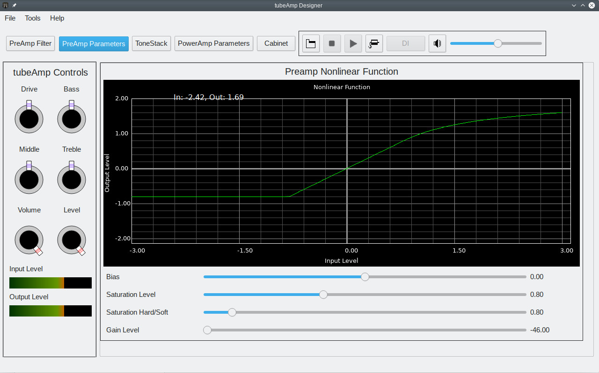

tubeAmp Designer
================

Last release is 1.2.

[Official site](https://kpp-tubeamp.com)

>Standalone software guitar processor, editor of *.tapf profile files for tubeAmp (KPP) and guitar amp profiler.

Binary files are available for Linux 64-bit systems.
Source code can be compiled for Linux 64-bit or 32-bit.
Windows versions are planned for the future.

### Features

1. Manually set any of the tubeAmp parameters - edit or create Profiles for tubeAmp.
2. Pass Test Signal through any real guitar amplifier, or guitar processor (hardware or software), and get new Profile for tubeAmp.
3. Automatically adjust any tubeAmp Profile to sound like Reference record (Auto Equalizer feature).
4. Use it as standalone guitar processor application. With Carla host you can use LADSPA or LV2 plugins with tubeAmp Designer.
5. Use Convolver feature to add reverberation or equalization effect by impulse response method to the Profile.
6. Use Deconvolver feature to get impulse responses from cabinets, rooms, reverberators, equalizers.

### Dependencies for using Appimage binary version

1. JACK audio server.

### Dependencies for building

1. g++ compiler.
2. Meson-0.51+ build system.
3. Qt framework development files
4. Zita-resampler 1.6+ development files.
5. Zita-convolver 4.0+ development files.
6. Faust 2.x compiler and libraries.
7. fftw3 development files.
8. GSL development files.

In Ubuntu run:

`apt install g++ qtbase5-dev libjack-dev qtchooser libgsl-dev libfftw3-dev libzita-resampler-dev libzita-convolver-dev faust meson`

**Attention!!!** Even in Ubuntu Focal Fossa zita-resampler is old 3.x! So use `thirdparty-included`
branch in this case, instead of `master`!

**Attention!!!** Check version of `faust` in your distro! Ubuntu Bionic Beaver has old 0.9.x version!
In this case build latest version of `faust` from source.

**Attention!!!** Check version of `meson` in your distro! Ubuntu Bionic Beaver has old version!
In this case build latest version of `meson` from source.

### How to build and install

Project now uses meson build system.

1. Run `meson build` and then `ninja -C build` in the source directory.
2. Run `ninja -C build install` to install to /usr/local/*.
   To install to /usr directory, run
  `meson build --reconfigure --prefix /usr` and then
  `ninja -C build install`.
3. Application will be added to the system menu. From command line you cabn launch `tAD`.

### Quick start guides

[English](https://kpp-tubeamp.com/guides)

## Development

DSP code is written in Faust language. GUI and support code is written in C and C++
with Qt Framework.

## License

GPLv3+.
